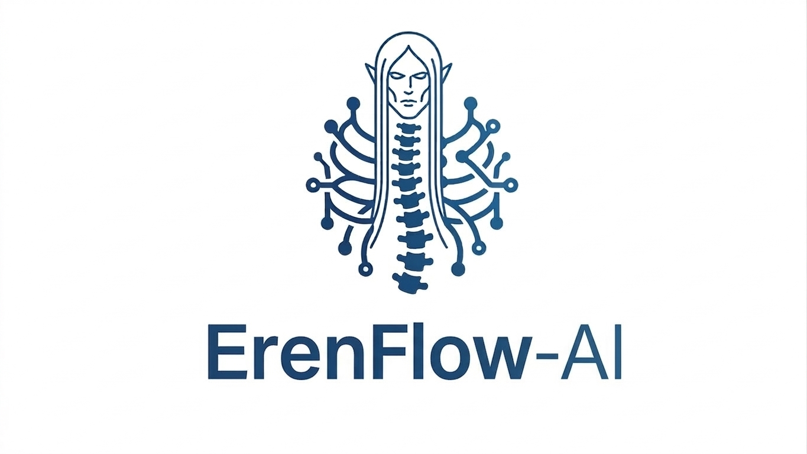

# FlowgentraAI: Build Intelligent Agents in Rust

<div align="center">
  
</div>

**Making AI agents simple, powerful, and fun to build.**

FlowgentraAI is your toolkit for creating sophisticated AI agents that think, plan, and solve problems.

## 💡 What Can You Build?

- **Research agents** that gather and synthesize information
- **Support bots** that remember conversations and help customers  
- **Auto-healing systems** that diagnose and fix themselves
- **Planning engines** that decide what to do next (dynamically!)
- **Analysis pipelines** that process documents and data
- **Hybrid workflows** mixing human decisions with AI reasoning

## ✨ Key Features

### 🤖 Predefined Agents
No complex graphs needed - just pick your agent type:
- **ZeroShotReAct** - General reasoning agent
- **FewShotReAct** - Agent that learns from examples
- **Conversational** - Chat agent with memory

### 💾 Memory & Checkpointing
Your agents remember:
- Conversation history (for multi-turn chats)
- Execution state (resume interrupted workflows)

### 🎓 Auto-Evaluation
Agents grade their own work and improve:
- Automatic confidence scoring
- Self-correction on low quality  
- Intelligent retries

### 🧠 Dynamic Planning
LLM decides what to do next (no hardcoding):
- Flexible, adaptive workflows
- Responds to changing conditions
- Complex multi-step reasoning

### 🔌 Tools & Integrations
Connect to anything:
- **Local Tools** - Run functions directly
- **MCP Services** - HTTP, stdio, or Docker services
- **Vector Stores** - Pinecone, Weaviate, Chroma
- **LLMs** - OpenAI, Anthropic, Mistral, Groq, Ollama, Azure

### 📊 Multi-LLM Support
- Fallback chains (try OpenAI, fall back to Anthropic)
- Provider-agnostic handlers
- Easy switching

## 🚀 Quick Start

### 1. Add to Cargo.toml

```toml
[dependencies]
flowgentra-ai = "0.1"
tokio = { version = "1", features = ["full"] }
serde_json = "1.0"
```

### 2. Build a Graph

The core API is `StateGraph` - build workflows as directed graphs:

```rust
use flowgentra_ai::prelude::*;
use serde_json::json;

// Define a node function
async fn greet(state: &DynState) -> Result<DynState> {
    let name = state.get("name")
        .and_then(|v| v.as_str())
        .unwrap_or("World");
    
    state.set("greeting", json!(format!("Hello, {}!", name)));
    Ok(state.clone())
}

#[tokio::main]
async fn main() -> Result<()> {
    // Build the graph
    let graph = StateGraphBuilder::new()
        .add_node("greet", Box::new(FunctionNode::new(greet)))
        .set_entry_point("greet")
        .add_edge("greet", "__end__")
        .compile()?;
    
    // Create state and run
    let state = DynState::new();
    state.set("name", json!("Alice"));
    
    let result = graph.invoke(state).await?;
    println!("{}", result.get("greeting").unwrap());
    // Prints: "Hello, Alice!"
    
    Ok(())
}
```

### 3. Load from Config (Optional)

For more complex agents, use a config file:

```rust
let agent = from_config_path("config.yaml")?;
let state = DynState::new();
let output = agent.run(&state).await?;
```

**→ [See Full Documentation](./flowgentra-ai/docs/README.md)**

## 📚 Documentation  

| What | Where | Time |
|------|-------|------|
| **Getting Started** | [flowgentra-ai/docs/QUICKSTART.md](flowgentra-ai/docs/QUICKSTART.md) | 5 min |
| **Feature Guide** | [flowgentra-ai/docs/FEATURES.md](flowgentra-ai/docs/FEATURES.md) | 15 min |
| **State Management** | [flowgentra-ai/docs/state/README.md](flowgentra-ai/docs/state/README.md) | 15 min |
| **Graph Engine** | [flowgentra-ai/docs/graph/README.md](flowgentra-ai/docs/graph/README.md) | 20 min |
| **Configuration Guide** | [flowgentra-ai/docs/configuration/CONFIG_GUIDE.md](flowgentra-ai/docs/configuration/CONFIG_GUIDE.md) | 20 min |
| **Advanced Patterns** | [flowgentra-ai/docs/DEVELOPER_GUIDE.md](flowgentra-ai/docs/DEVELOPER_GUIDE.md) | 30 min |
| **Full Documentation Hub** | [flowgentra-ai/docs/README.md](flowgentra-ai/docs/README.md) | Browse all topics |

## 📖 Core Concepts

### StateGraph

The core of FlowgentraAI is a **directed acyclic graph (DAG)** where:
- **Nodes** = Async functions that process state
- **Edges** = Connections defining execution flow  
- **State** = Key-value data flowing through the graph
- **Conditional Edges** = Runtime routing based on state

### DynState

Flexible key-value state container for passing data between nodes:

```rust
let state = DynState::new();
state.set("user_input", json!("Hello"));
state.set("score", json!(42));
```

### Minimal Example

```rust
use flowgentra_ai::prelude::*;

async fn transform(state: &DynState) -> Result<DynState> {
    state.set("output", json!("transformed"));
    Ok(state.clone())
}

let graph = StateGraphBuilder::new()
    .add_node("transform", Box::new(FunctionNode::new(transform)))
    .set_entry_point("transform")
    .add_edge("transform", "__end__")
    .compile()?;

let result = graph.invoke(DynState::new()).await?;
```

## 🔗 Integration

FlowgentraAI supports:
- **LLM Providers**: OpenAI, Anthropic, Mistral, Groq, Azure, HuggingFace, Ollama
- **Vector Stores**: Pinecone, Qdrant, Weaviate, Chroma, In-Memory
- **Tools**: MCP Protocol (stdio, HTTP, Docker)
- **Memory**: Conversation history, Checkpointing

## 🤝 Contributing

See [CONTRIBUTING.md](CONTRIBUTING.md) for contribution guidelines.

## 📝 License

MIT License - See [LICENSE](LICENSE) for details.

---

**Ready to build? Start with [flowgentra-ai/docs/QUICKSTART.md](flowgentra-ai/docs/QUICKSTART.md)** 🚀
